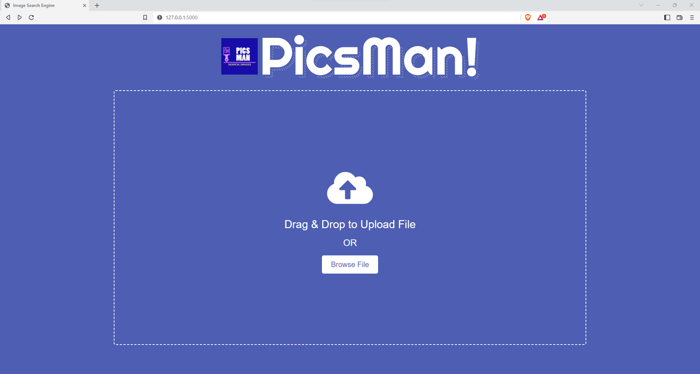

# Prediction Endpoint
This Repository is a prediction endpoint for Reverse Image Search Engine. With the use of gitHub actions 
I have configured CI-CD on the main branch. If any changes happens in Main branch it will deploy it on ec2 instance.

## Architectures 


## User Interface


## Infrastructure Needed
1. GitHub Actions
2. Elastic Container Registry
3. S3 Bucket and Mongo
4. Elastic Cloud Compute

## Project Setup

Get Aws Access Creds and update in Secrets.
```text
AWS_ACCESS_KEY_ID
AWS_SECRET_ACCESS_KEY
AWS_REGION
AWS_BUCKET_NAME
```
Create a Private Repository in Elastic Container Registry get it its name and url. And update it in secrets.
```text
AWS_ECR_LOGIN_URI
ECR_REPOSITORY_NAME
```
## Runner Setup 
### Step 1
```bash
sudo snap install docker
```
### Step 2
```bash
curl "https://awscli.amazonaws.com/awscli-exe-linux-x86_64.zip" -o "awscliv2.zip"
```
```bash
sudo apt install unzip
```
```bash
unzip awscliv2.zip
```
```bash
sudo ./aws/install
```
### Step 3
1. Install Github runner and Configure runner.
2. Run github runner as a ubuntu service ```sudo ./svc.sh install```
3. Start the service ```sudo ./svc.sh start```

### Step 4
In Inbound Security Rules open ssh and port 8080 to public.
## Cost Involved
```text
EC2 Instance : 	2vCPUs $0.0928 	On-Demand Price/hr*
ECR Repository : Storage is $0.10 per GB / month for data stored in private or public repositories.
    Data Transfer IN : $0.00 per GB
    Data Transfer OUT **: $0.1093 per GB / Next 9.999 TB / month
S3 Standard: $0.025 per GB / First 50 TB / Month
```
