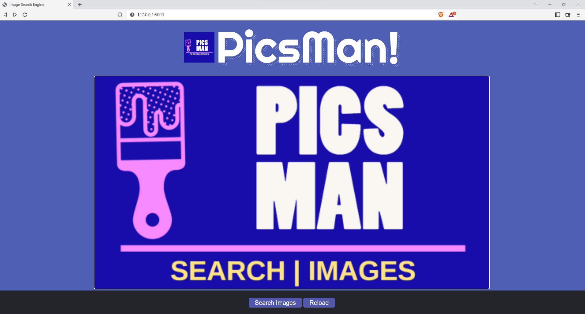
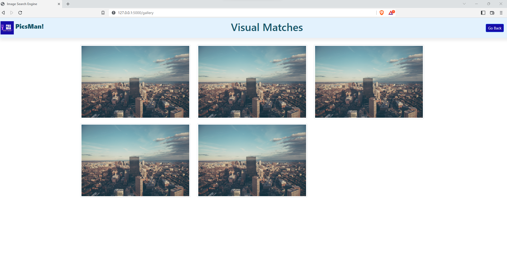

<h1 align="center"> SearchEngine-PredictionEndpoint</h1>

<hr>

##  <b> API</b>

1. Landing page of application


2. User uploads an image


3. If at this stage user want to upload another image then click on RELOAD


4. If user clicks on Search images then Galler API will get hit


`Note : In visual matches I kept static image files, which can be made dynamic based on search engine results`

💻 How to setup:

Creating conda environment
```
conda create -p venv python==3.8 -y
```

activate conda environment
```
conda activate ./venv
```

Install requirements
```
pip install -r requirements.txt
```
Run the live server using flask
```
python app.py
```
To launch flask UI
```
http://localhost:5000/
```
